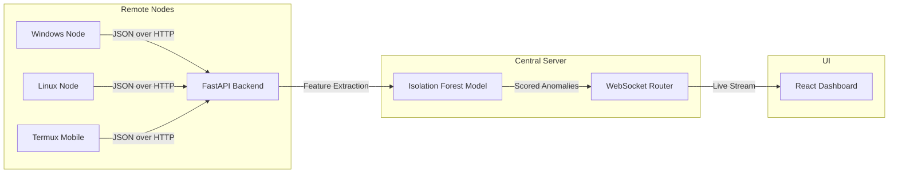

<div align="center">
  <h1>🛡️ NEMESYS: Network Traffic Anomaly Detector</h1>
  <p>A real-time, self-hosted SOC-style dashboard for detecting network anomalies using Machine Learning.</p>
</div>

---

## 📌 Overview

**NEMESYS (Network Traffic Sentinel)** is an advanced, real-time network traffic analysis and anomaly detection tool. It is designed to capture packets across multiple distributed nodes (Windows, Linux, Android/Termux) and stream them to a centralized FastAPI backend. 

The backend extracts flow-level features and runs them through an unsupervised **Scikit-learn Isolation Forest** model. Any anomalies or unusual traffic patterns are instantly broadcasted via WebSockets to a sleek, real-time **React (Vite)** dashboard.

---

## ✨ Features

- **Unsupervised Machine Learning**: Uses an Isolation Forest algorithm that doesn't require labeled attack data. It learns what "normal" traffic looks like and flags the outliers.
- **Multi-Node Telemetry**: Track and analyze traffic from multiple devices simultaneously. The dashboard allows you to filter and isolate traffic down to a specific device/node.
- **Cross-Platform Agents**: 
  - `telemetry_agent.py`: A lightweight, Wireshark-free agent using `psutil` that can run anywhere (even on mobile devices via Termux).
  - `tshark_agent.py`: A robust agent utilizing Wireshark's `tshark` engine for deep, raw packet capture.
- **Real-Time SOC Dashboard**:
  - Live charts of Packets per Second (PPS) and Throughput (BPS).
  - Instant Anomaly Feed with risk severity (Low, Medium, High, Critical).
  - Protocol Breakdown and Top Talkers analysis.
  - Interactive Node filtering.

---

## 🏗️ Architecture



---

## 🚀 Getting Started

### 1. Setup the Backend (FastAPI)

The backend acts as the central brain. It receives traffic, scores anomalies, and serves the WebSocket to the frontend.

```bash
cd backend
python -m venv .venv
# Activate virtual environment
# On Windows: .venv\Scripts\activate
# On Linux/macOS: source .venv/bin/activate

pip install -r requirements.txt
python -m uvicorn main:app --host 0.0.0.0 --port 8000
```

### 2. Setup the Frontend Dashboard (React + Vite)

The frontend provides the real-time SOC interface.

```bash
cd nemesys-traffic-dashboard
npm install
npm run dev
```
Access the dashboard at `http://localhost:5173`.

### 3. Start a Telemetry Agent

To actually see traffic, you need to run an agent on a device to stream packets to the backend.

**Option A: Lightweight Agent (No Wireshark required, works on mobile)**
```bash
pip install requests psutil
python telemetry_agent.py --url http://<BACKEND_IP>:8000
```

**Option B: Advanced TShark Agent (Requires Wireshark installed)**
```bash
pip install requests
python tshark_agent.py -i <INTERFACE_NAME> --url http://<BACKEND_IP>:8000
```

*(Note: Replace `<BACKEND_IP>` with the IP of the machine running the FastAPI server. Replace `<INTERFACE_NAME>` with your active network interface like `eth0`, `wlan0`, or `Wi-Fi`)*.

---

## 💻 Tech Stack

- **Backend**: Python, FastAPI, Uvicorn, Scikit-learn, Pandas, Asyncio.
- **Frontend**: React, Vite, TailwindCSS, Recharts, Lucide React.
- **Agents**: Python, Requests, Psutil, Subprocess (TShark).

---

## 📝 License
This project is created for educational and security research purposes.
